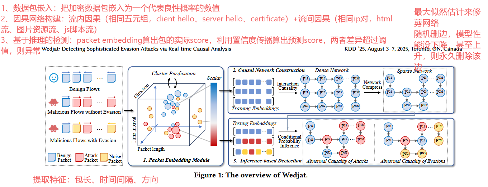
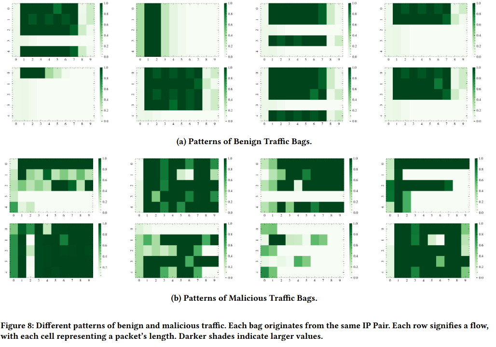
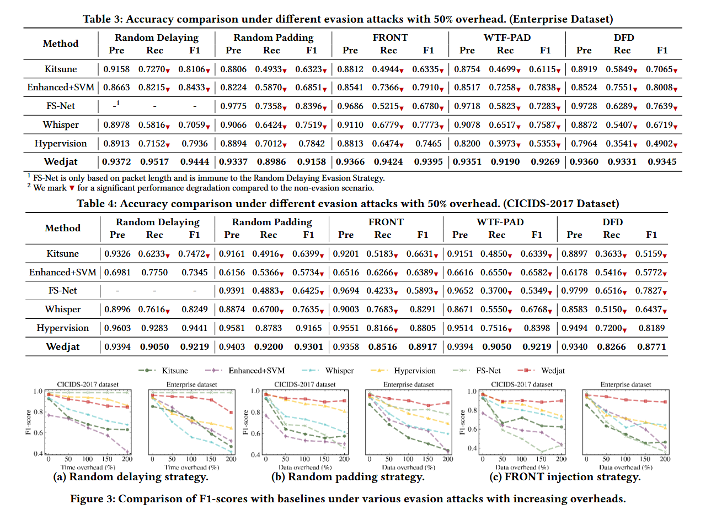

# 0116-周报

## Wedjat: Detecting Sophisticated Evasion Attacks via Real-time Causal Analysis-恶意流量检测+扰动场景-a会

### 现有问题

基于统计特征的检测模型容易被攻击者通过注入扰动（如插入虚假数据包、填充字节、故意延迟）来改变这些特征，从而轻松绕过检测系统。

### 解决方法

构建因果网络+新颖的数据包嵌入方法

### 数据集

企业网络真实数据集

CICIDS-2017 (公开数据集)：涵盖 12 种不同类型的攻击（如 Botnet, DDoS, Web 攻击等）和良性流量。

### 实验

对抗规避攻击的鲁棒性

检测效率

### 总结

针对加密流量中的规避问题，通过实时因果分析来解决。

因果网络（包为节点，依赖概率为边）、包嵌入方法（将一个包嵌入为一个score）这两部分可以借鉴