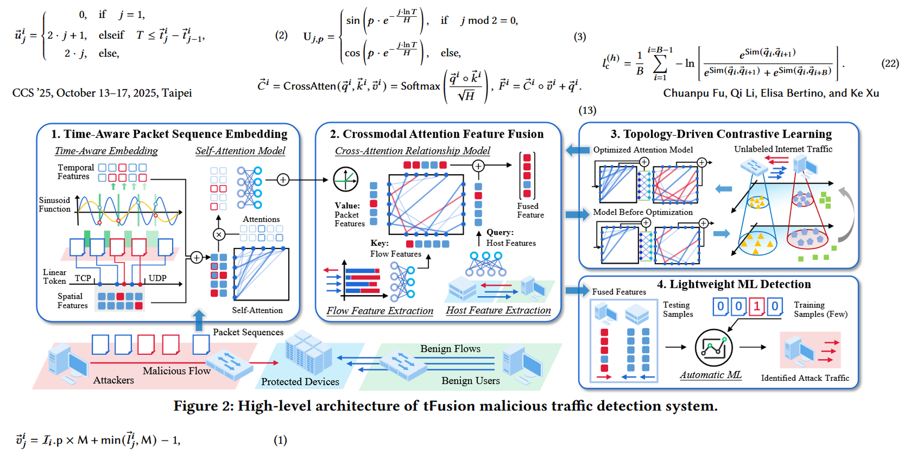
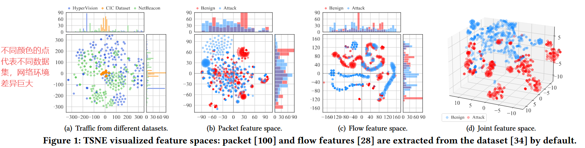
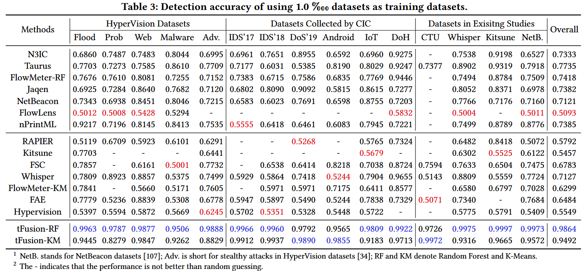
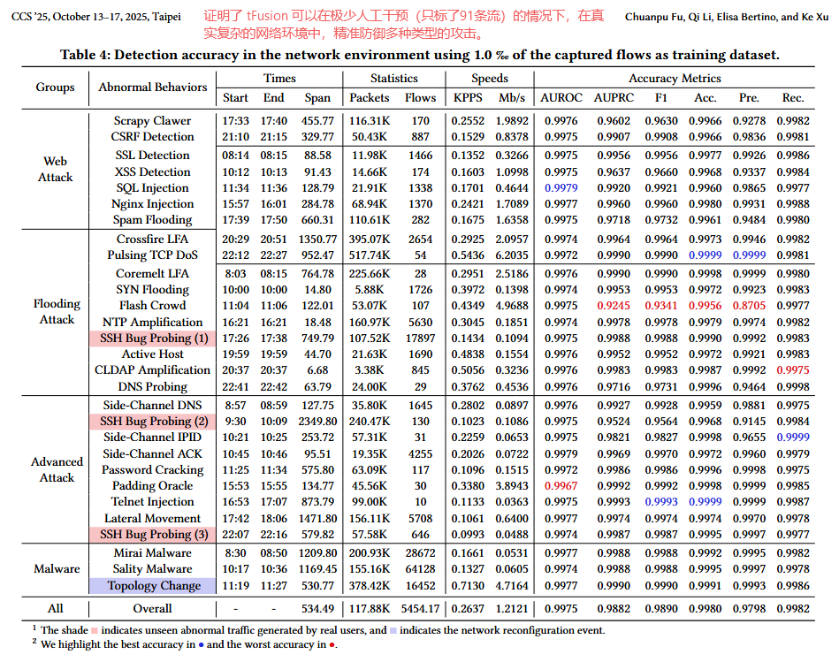
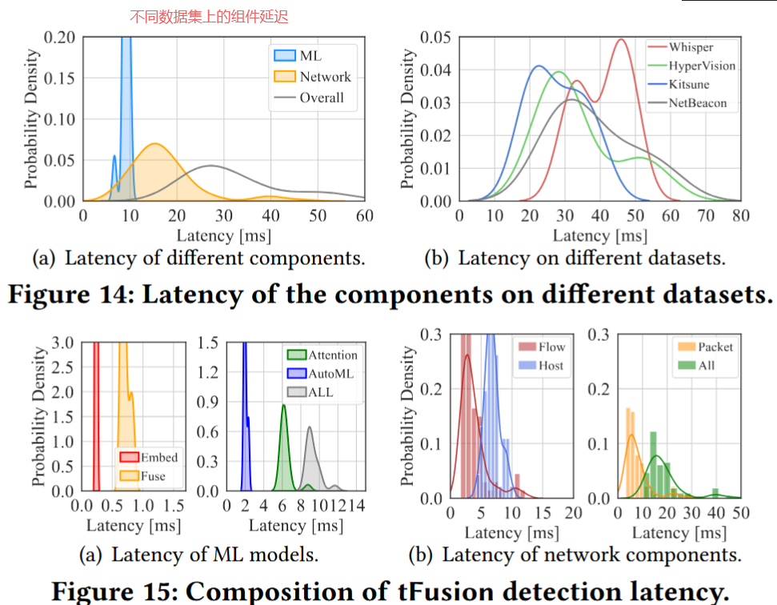
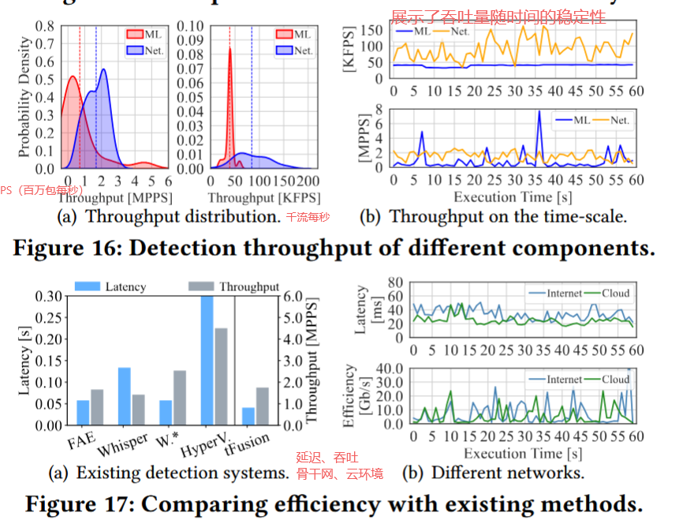
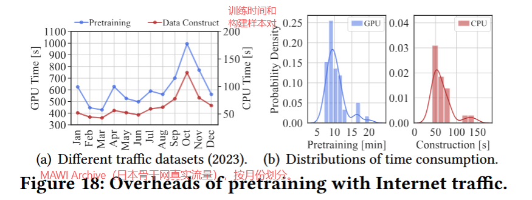

# 0122-周报

## Training with Only 1.0 ‰ Samples: Malicious Traffic Detection via Cross-Modality Feature Fusion-异常检测+少标注样本+特征融合

### 问题

1. **数据标注成本高昂**: 现有的ML检测系统依赖大规模标注数据集。在新网络环境中部署时，采集和标注数百万个良性和攻击数据包需要极高的人力成本
2. **信息丢失**: 现有方法通常将流量视为“单模态”数据（仅分析**包序列**、仅分析**流统计**或仅分析**主机行为**），无法综合不同粒度的特征，导致信息丢失，从而需要更多的数据来拟合模型。

### 解决方法

| **包特征 (Packet)**                                          | **流特征 (Flow)**                                            | **主机特征 (Host)**                                          |
| ------------------------------------------------------------ | ------------------------------------------------------------ | ------------------------------------------------------------ |
| 每个包的大小、到达时间间隔、方向。                           | 一次完整会话的总结：总字节数、总包数、平均包长、流持续时间。 | 该IP在时间窗口内的社交行为：发了多少流、联系了多少个不同IP、作为Server还是Client。 |
| 捕捉**时空模式**。例如：是否有周期性的心跳包？包大小是否突然变大（Payload攻击）？ | 捕捉**统计异常**。例如：下载大文件（字节数巨大）、端口扫描（极短流）。 | 捕捉**群体/拓扑异常**。例如：DDoS攻击（短时间内接收大量不同IP的流）、Botnet指令（一对多发送）。 |

### 数据集

文章共使用了 **11个公开数据集** 和 **1个实地采集的数据集**，涵盖约150种不同的攻击。

1. **HyperVision Datasets**: 包含利用真实漏洞（如CVE）生成的加密恶意流量。
2. **CIC系列数据集 (由加拿大网络安全研究所收集)**:
   - **CIC-AndMal2017**: Android恶意软件流量。
   - **CIC-IoT2023**: IoT网络中的隐蔽攻击。
   - **CIC-IDS2017 / IDS2018**: 企业网络入侵检测数据集。
   - **CIC-DoS2019**: 应用层DoS攻击。
   - **DoHBrw-2020**: DoH (DNS over HTTPS) 隐蔽通道流量。
3. **Whisper Datasets**: 包含侦察攻击、链路泛洪攻击 (LFA)、脉冲攻击等。
4. **Kitsune Datasets**: 针对IoT设备的攻击流量（如Mirai僵尸网络）。
5. **NetBeacon Datasets**: 私有云环境中的流量。
6. **CTU-13**: 校园网僵尸网络流量。
7. **MAWI Archive (用于预训练)**: 日本骨干网的大规模无标签流量（真实世界流量）。
8. **Institutional Network (实地部署)**: 作者在拥有140+活跃用户的机构网络中实地采集的流量，包含红队模拟的攻击。

### 实验

融合后的特征更易分辨

性能对比

面对不同攻击手段的分类性能

体现低延迟

### 总结

针对网络安全领域中恶意流量检测模型在新环境下部署难、标注成本高这一问题

文章的核心思想是**“多模态融合”**。作者认为单一维度的流量特征（无论是看包、看流还是看主机）都是不完整的，只有将微观的包序列时空特征与宏观的流/主机统计特征结合，才能在数据极少的情况下还原流量的全貌。

