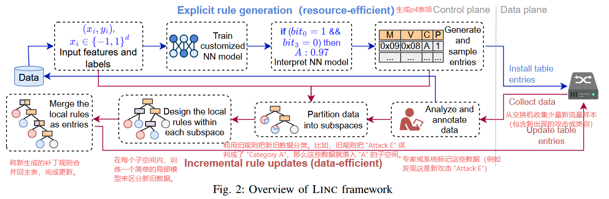
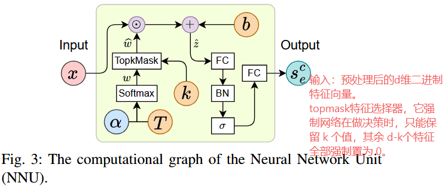
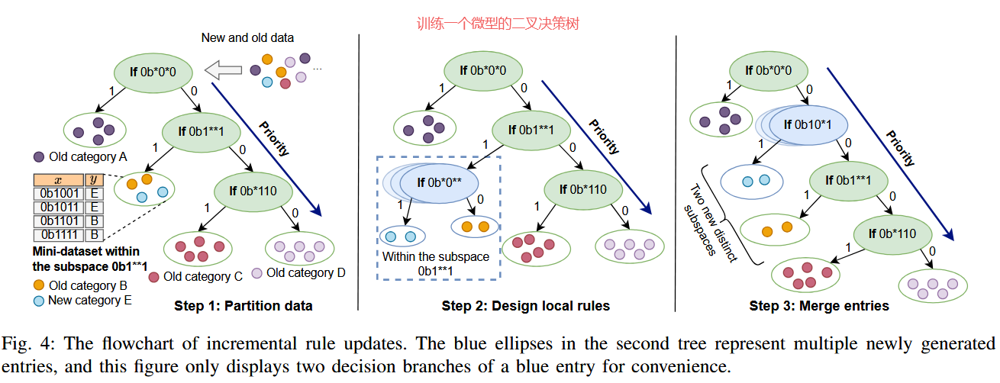
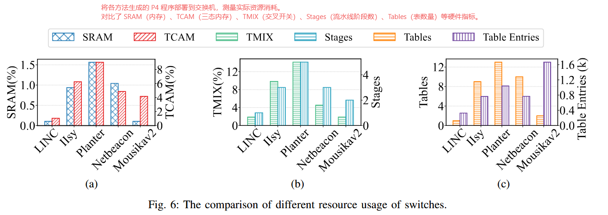
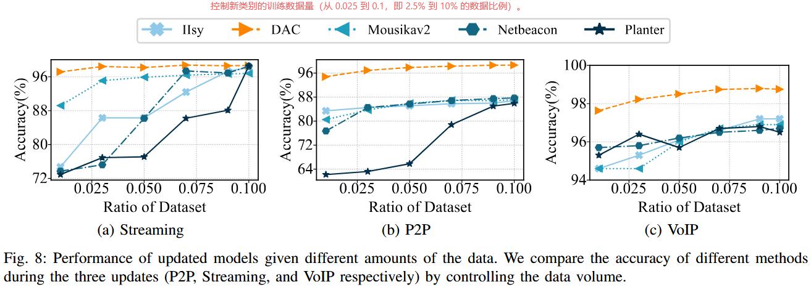
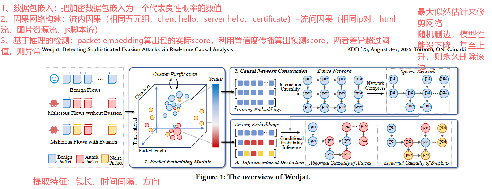
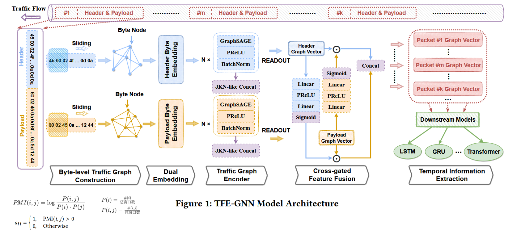
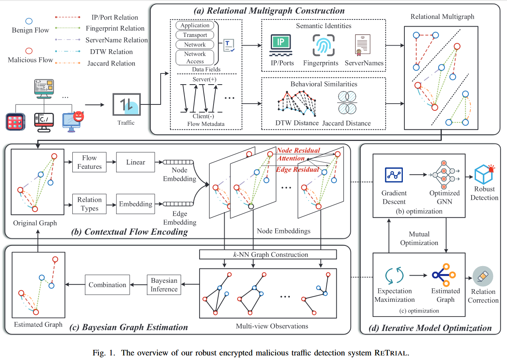
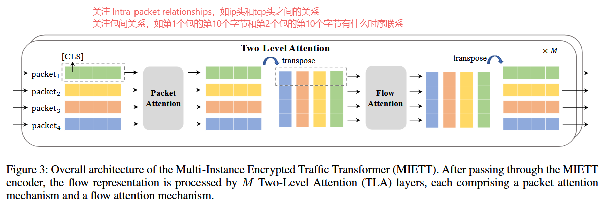
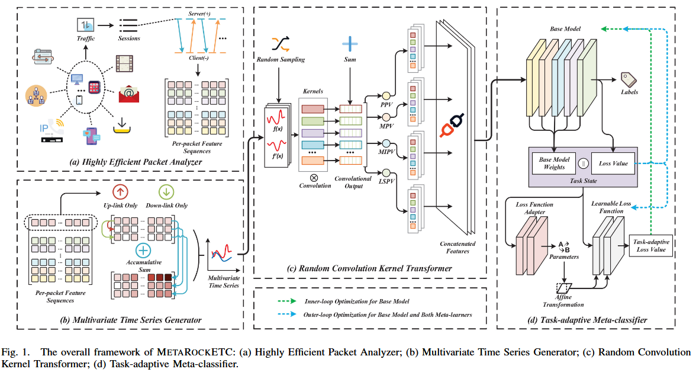

# 0129

## LINC: Enabling Low-Resource In-network Classification and Incremental Model Update-关注在交换机上部署分类器所遇到的问题

### 问题

1. **硬件资源受限**：可编程交换机内存非常有限，且需保留资源给基础转发功能。现有方法（如决策树、随机森林）往往需要在模型复杂度和资源消耗之间做权衡，导致性能下降。
2. **增量更新困难**：网络流量分布会随时间变化，需要更新模型。
   - 传统重训练方法耗时且中断业务。
   - 少样本学习（Few-Shot Learning）难题：新出现的流量类别往往只有少量标注数据，直接重训练会导致模型对旧数据过拟合或对新数据识别率低。

### 解决方法

### 数据集

1. **UNIV1**
   - **内容**：用于预测流的大小，具体是区分“大流”（Elephants）和“小流”（Mice）。
   - **来源**：校园网流量数据。
2. **ISCX**
   - **内容**：用于识别不同的应用层流量类型。
   - **类别**：Email, Chat, Streaming, File Transfer, VoIP, P2P 等。
3. **UNSW-NB15**
   - **内容**：用于入侵检测，区分正常流量和恶意流量。
   - **特征**：利用了 IPv4 (ihl, tos, length, flags, ttl, proto), TCP (offset, flags, window), UDP (length) 等包头特征。

### 实验

**资源消耗少**

**增量更新性能好**

### 总结

针对可编程交换机**资源受限及流量模式动态变化**的双重挑战，摒弃了传统的“大模型蒸馏到决策树”的复杂路径，转而采用一种定制化的神经网络直接学习特征与类别的稀疏映射（即将分类规则映射为交换机表项），从而生成极低资源消耗的显式匹配规则。

暂时不会研究模型资源消耗的问题

## 可参考模块汇总

总结了可用在未来工作中的模块。

1. ***Wedjat: Detecting Sophisticated Evasion Attacks via Real-time Causal Analysis--KDD ’25***

- **数据包嵌入模块**
  - 设计目的：将加密数据包嵌入为一个代表良性概率的数值
  - 针对的问题：数据包格式不统一、处理扰动数据、“未知”的数据包
- **因果网络构建模块**
  - 设计目的：建模相关流中数据包之间的交互模式（流内因果+流间因果），捕捉良性流量的因果依赖关系
  - 针对的问题：逃逸攻击（如插入假包、延迟发包）会破坏正常的协议交互模式和流间依赖，传统统计特征难以检测这种时序和逻辑上的违规。

2. ***Training with only 1.0 ‰ samples: Malicious traffic detection via cross-modality feature fusion--CCS ’25***

- **时间感知包序列嵌入**
  - 设计目的：在包长序列中加入时间信息
  - 针对的问题：传统包长序列只关注顺序，忽略了数据包到达时间间隔这一关键测信道信息
- **跨模态注意力特征融合**
  - 设计目的：融合包级特征、流级特征、主机级特征
  - 针对的问题：单一模态特征信息量不足，导致需要大量样本才能训练好模型。通过多模态关联，可以在极少样本下挖掘出更丰富的信息。

3. ***TFE-GNN: A temporal fusion encoder using graph neural networks for fine-grained encrypted traffic classification--WWW ’23***

- **字节级流量图构建**
  - 设计目的：将原始字节流（加密流量）转化为图结构，挖掘字节间的潜在关联。
  - 针对的问题：传统方法要么只用统计特征（不稳定），要么只用原始字节序列（利用率低），忽略了字节间的语义关联。
- **包头和载荷双重嵌入**
  - 设计目的：分别处理包头和载荷的语义。
  - 针对的问题：相同的字节值在包头（如协议标志）和载荷（如加密数据）中含义完全不同，混合处理会造成语义混淆。

4. ***ReTrial: Robust encrypted malicious traffic detection via discriminative relation incorporation and misleading relation correction--IEEE TIFS 2025***

- **关系多重图构建**

  - 设计目的： 全面建模流之间的复杂交互关系（节点：加密流；边：相同目的ip/port、相同TLS指纹（JA3/JAS3）、相同SNI、基于DTW的包长序列相似性、基于Jaccard距离的相似性）。

  - 解决问题： 现有的图方法构图简单，且容易受到攻击者引入的虚假关系（如伪造IP）的影响。

- **上下文流编码**
  - 设计目的： 设计改进的图注意力网络，在计算注意力系数时，不仅考虑节点特征，还显式地加入“边类型”的嵌入，实现对不同关系的差异化聚合。
  - 解决问题：区分不同关系的重要性，避免被无关或恶意的邻居误导。

- **贝叶斯图估计-关键**

  - 设计目的： 推断真实的流交互图结构，修正误导性关系。

  - 解决问题： 原始构建的图中包含大量由逃逸攻击（如IP切换、指纹伪造）引入的噪声边。

  - 实现过程：
    1. 观察： 将GNN每一层的中间节点嵌入构建为k-NN图，作为“多视图观察值”。
    2. 推断： 假设存在一个潜在的“最优图”，利用贝叶斯推断，结合观察值和随机块模型（SBM）先验，计算最优图的后验概率。

- **迭代模型优化**

  - 设计目的： 联合优化GNN编码器和图结构。使用EM算法（期望最大化）

  - 解决问题： 更好的图结构能训练出更好的GNN，更好的GNN能产生更准确的观察值来修正图结构。

5. ***MIETT: Multi-instance encrypted traffic transformer for encrypted traffic classification--AAAI-25***

- **双层注意力层**

  - 设计目的： 分层次提取特征，兼顾包内细节和包间关系。

  - 解决问题： 降低计算复杂度，同时捕捉层次化依赖。

6.  ***MetaRockETC: Adaptive encrypted traffic classification in complex network environments via time series analysis and meta-learning--IEEE TNSM 2024***

- **随机卷积核变换器**

  - 设计目的： 极其高效地提取具有判别力的序列模式特征，生成大量随机卷积核（长度、权重、膨胀率、偏置均随机），对多元时间序列进行卷积操作。主要目的是丰富包长序列的向量维度

  - 解决问题： 深度学习训练慢、计算重。Rocket方法无需训练卷积核，速度极快。

