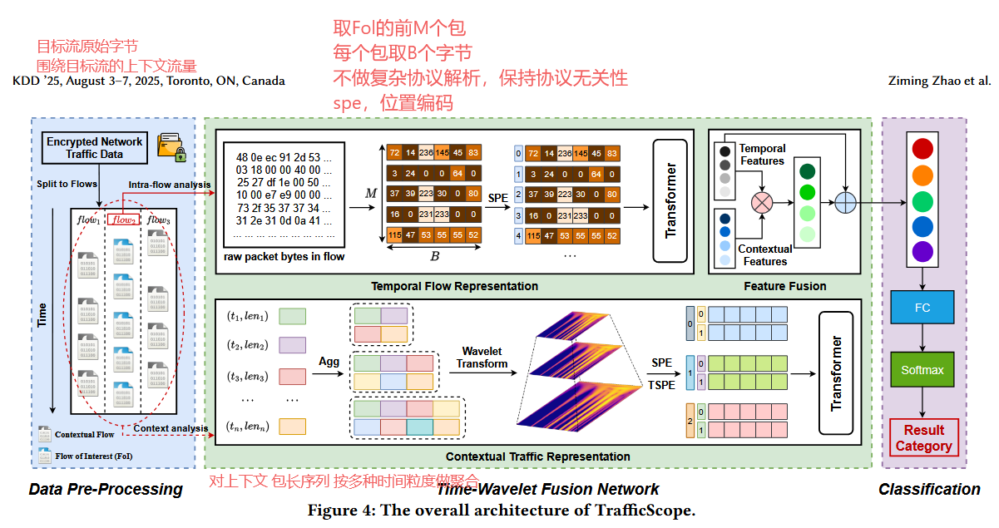
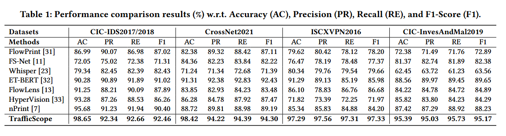

# 0311-周报

## Towards Context-Aware Traffic Classification via Time-Wavelet Fusion Network-KDD‘25

### 问题

1. 只看单条流（包长序列、时间间隔、流统计特征、报文字节）不够

2. 某些恶意流量与正常流量在流内行为上天然相似
3. 上下文流量是动态且非平稳的，难以直接利用

### 解决方法

流（flow）+上下文流量



### 数据集

1. **入侵检测任务：CIC-IDS2017 和 CIC-IDS2018**

2. **桌面应用识别任务：CrossNet2021**

3. **VPN流量分类任务：ISCXVPN2016**

4. **恶意软件识别任务：CIC-InvesAndMal2019**

### 实验



### 结论

添加上下文流量，该方法知道借鉴

## 跑代码

创新点（相对常规流量分类）参考：tfusion+retrial

- 三模态联合：包时序特征 + flow 统计 + host 交互统计，不只依赖单流统计量。
  跨模态融合机制：host=Q, flow=K, packet=V 的 Hadamard attention，并保留 concat/add 消融。
- 多关系图建模：把语义不同的边类型并行注入同一图，支持平行边。
- 关系感知注意力：边类型嵌入参与 attention 计算，不同关系自适应赋权。
  边可靠性门控：
- w_e=sigmoid(MLP([x_i,x_j,type]))，聚合时抑制低可信边。
- 训练期图精炼：用当前表示反向修图，提升噪声关系鲁棒性

```python
LABEL_MAP: Dict[str, int] = {
    "chat": 0,
    "email": 1,
    "file_transfer": 2,
    "p2p": 3,
    "streaming": 4,
    "voip": 5,
    "web_browsing": 6,
}
```

实验记录

数据集：vpn

| 实验设置                    | macro_f1 | macro_precision | macro_recall |
| --------------------------- | -------- | --------------- | ------------ |
| qkv融合 关系边 训练反向修边 | 0.5455   | 0.7441          | 0.5236       |
|                             |          |                 |              |

实验结果分析

```json
"per_class_support": [
      500,
      598,
      6230,
      56482,
      4284,
      1068,
      26224
    ]
```

类别不均衡