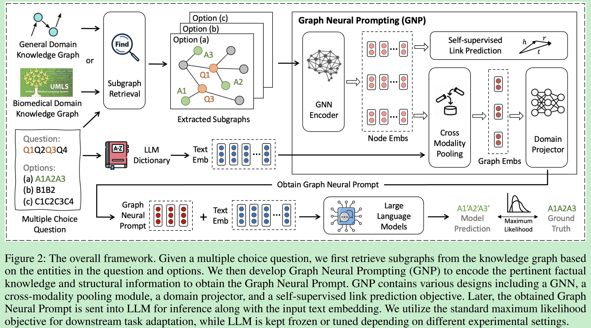
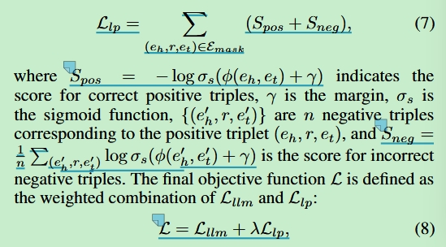
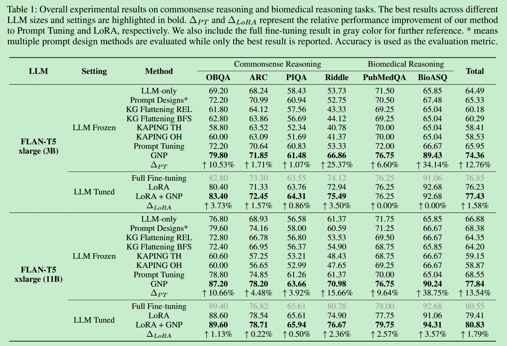

# Graph Neural Prompting with Large Language Models

## info

**单位**：University of Notre Dame & Amazon

**期刊**：AAAI 2024

**代码链接**：https://github.com/meettyj/GNP

## 摘要

大型语言模型（LLM）在各种语言任务中表现出色，但在捕捉和返回**有依据的知识**时仍存在局限。以往的工作尝试通过联合训练和定制模型架构将知识图谱集成到语言模型中，但这种方式在 LLM 上难以实现，因为参数量巨大、计算开销高。本研究提出了 **Graph Neural Prompting (GNP)**，一种新颖的即插即用方法，旨在帮助预训练 LLM 从知识图中学习有用的知识。GNP 包括标准 GNN 编码器、跨模态池化模块、领域投影器和自监督链路预测目标。大量实验证明，GNP 在常识推理和生物医学推理任务上优于现有方法，适用于不同大小的 LLM 模型。

## 创新点

**1、GNP：**将KG嵌入作为token注入到LLM输入中，实现“图-文本”的结合

**2、自监督链路预测任务：**引入mask边任务（将KG中的三元组<h,r,t>中的r隐藏，设计得分函数，训练模型预测边的属性），使用DistMult方法（一个经典的知识图谱嵌入方法）。从而增强LLM对KG边的理解能力。

**3、可插拔设计：**GNP是一种“即插即用”的方法，不需要修改LLM内部结构，兼容多种LLM。

## 框架图及方法

**1、Subgraph Retrieval**

在KG中获取与问题相关的子图

**2、GNP**

图嵌入-->注意力机制融合文本向量-->投影层降维-->图神经提示

​			-->自监督链路预测(训练LLM，增加对KG边的理解)

**3、损失函数**

公式（7）是根据KG边的得分设计的损失函数，lp=Link Prediction

公式（8）Lllm是交叉熵损失（标准最大似然损失）可以让 LLM 学习生成正确的答案，是大LLM最经典的训练方式

## 实验部分

### 数据库和知识图谱

**1、ConceptNet 5.5**

来源：由 Speer 等人提出，是一个**开放的多语言通用知识图谱**；

内容：收录了**实体和概念之间的关系**，如“狗 isA 动物”，“苹果 AtLocation 超市”等，边的类型包括 IsA、PartOf、CapableOf 等；

作用：为**常识推理任务**提供支持，帮助模型理解基本的世界知识。

**2、UMLS（Unified Medical Language System）**

来源：由美国国家医学图书馆开发（Bodenreider 2004）；

内容：一个**整合的生物医学术语体系**，包含众多子库（如 SNOMED CT、MeSH、ICD 等），关系类型包括“症状-疾病”、“药物-治疗”等；

作用：广泛应用于**医学问答和生物医学推理任务**，是医疗领域标准的知识图谱。

 **3、OBQA（OpenBookQA）**

来源：由 Bisk 等人提出，是一个**常识问答数据集**；

内容：问题多是**自然科学领域的小学知识**，结合外部背景知识库完成推理；

作用：测试模型的**推理能力**，尤其是在需要背景知识的场景中很有挑战性。

 **4、ARC（AI2 Reasoning Challenge）**

来源：由 AI2 发布，是一个**科学推理挑战数据集**；

内容：涵盖科学常识题目（小学到中学水平），支持**多选题**；

作用：广泛用于**问答系统的推理能力评估**，尤其是图谱增强任务中常用的数据集。

 **5、PubMedQA**

来源：由 Jin 等人发布，专注于**生物医学领域的问答任务**；

内容：数据基于 PubMed 文献，问题大多是“是/否/可能”三类选择题；

作用：专为**生物医学问答系统**设计，测试模型在专业医学语料下的表现。

 **6、BioASQ**

来源：由 Tsatsaronis 等人主导的国际比赛（BIOASQ Challenge）；

内容：用于**生物医学语义索引和问答**，涵盖多种任务，包括事实性问题、列表型问题等；

作用：为医学 NLP 提供权威基准，评估模型在医学问答和信息检索中的能力。

| 数据库/数据集 | 领域     | 用途                       |
| ------------- | -------- | -------------------------- |
| ConceptNet    | 常识图谱 | 提供通用常识，助力常识推理 |
| UMLS          | 医学图谱 | 医学问答、生物医学推理     |
| OBQA          | 常识问答 | 科学领域问答挑战           |
| ARC           | 科学推理 | 常识/科学推理任务          |
| PubMedQA      | 生物医学 | 生物医学文献问答           |
| BioASQ        | 生物医学 | 医学语义检索/问答比赛      |

### 实验结果

| 方法 (Method)         | 含义与做法                                                   |
| --------------------- | ------------------------------------------------------------ |
| **LLM-only**          | 仅使用 LLM 本体，不加任何提示，是最基础的对比组。            |
| **Prompt Designs***   | 多种硬提示（文本提示）方法，选择表现最好的那个报告结果。     |
| **KG Flattening REL** | 把知识图谱扁平化为序列，用 Relevance Score (REL) 排序注入。（把知识图直接变成文本输入） |
| **KG Flattening BFS** | 把知识图谱扁平化为序列，用广度优先搜索 (BFS) 排序注入。      |
| **KAPING TH/OH**      | 注入 KG 中的两跳邻居 (TH) 或一跳邻居 (OH) 作为提示。基于现有工作（如 KAPING 方法），把与问题相关的 KG 片段直接喂给 LLM，测试直接注入图结构的效果 |
| **Prompt Tuning**     | 标准软提示微调，使用可训练的软提示向量。                     |
| **GNP**               | 本文提出的 Graph Neural Prompting 方法，将 KG 嵌入图神经提示。 |
| **Full Fine-tuning**  | 全量微调 LLM 的参数。                                        |
| **LoRA**              | 使用 LoRA 微调，低秩适配器仅微调部分参数。                   |
| **LoRA + GNP**        | 在 LoRA 的基础上再加上 GNP 图神经提示。                      |