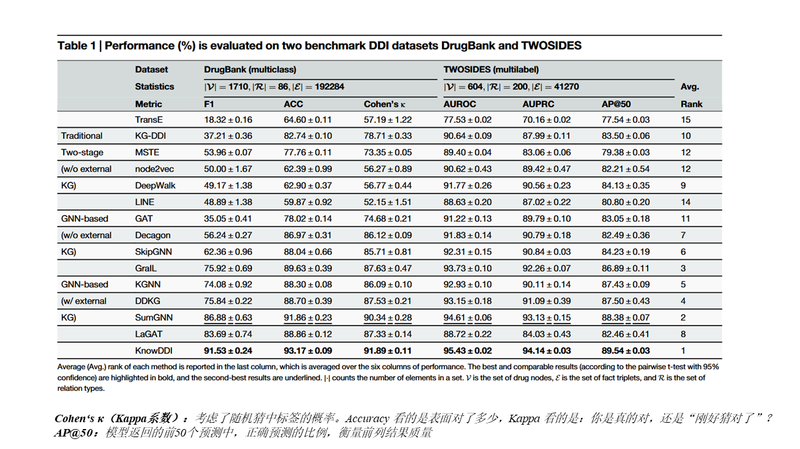

# 0808-周报

## DIY卡片质量检测方法

#### **面临的问题：**

1、每张卡片具有唯一性，无法获取标准正常样本，传统监督学习方法难以适用。

2、当通过DIY 预览图（如渲染图、设计图稿）与实际生产出的卡片的图片进行比对，会有背景/颜色差异、位置/视角变形等问题

#### **两阶段检测策略：**

- **视觉层面检测：**基于无监督算法（如 PatchCore / FastFlow）识别划痕、气泡、污点等图案异常。
- **结构要素检测**：基于预览图做结构模板，通过图像配准与区域对比判断 Logo、芯片、卡号、防伪图案的位置与尺寸合法性。

#### **输入数据：**

- 每张卡片的 DIY 预览图（设计图）
- 实拍图像（多个角度，如正视、斜视等 6~8 张）
- 紫光图（用于防伪图案检测）

#### **输出结果：**

- 每张图像的缺陷分数、热力图（heatmap）
- 结构偏移量（以毫米计）与位置合规判断
- 防伪图案是否存在判断结果
- 最终合格/不合格综合判定

### Anomalib：工业异常检测的开源利器

*由 Intel OpenVINO 团队开发，集成多种 SOTA 无监督算法*

**优势：**

开源异常检测工具库

聚焦无监督视觉检测（图像/视频）

支持训练、推理、可视化、部署一体化

#### 工具库中的部分算法

| 算法名    | 类型       | 特点                   |
| --------- | ---------- | ---------------------- |
| PatchCore | 最近邻匹配 | 小样本表现强           |
| PaDiM     | 高斯建模   | 推理快、部署友好       |
| STFPM     | 模仿学习   | 多尺度、定位准         |
| FastFlow  | 概率建模   | 实时检测、结构轻       |
| Ganomaly  | GAN重建    | 图像生成对比（需训练） |

### 算法：PathCore-patch特征+最近邻

*论文：Towards Total Recall in Industrial Anomaly Detection**（**CVPR2022）*

**算法思路：**1、只使用少量无瑕疵图进行训练；2、使用预训练模型ImageNet生成图向量；3、核心集子采样（Coreset Subsampling），从中挑选出最有代表性的一小部分特征；4、将特征信息存入Memory Bank中；5、将带检测的图片进行相同的操作，结合Memory Bank，使用KNN遍历每个特征，计算相似性；6、相似性低于阈值则检测不合格

**卡片检测中：**如一张卡片拍摄8张图片，7张来构建Memory Bank，1张来test

### 算法：PaDIM-pathch特征+马氏距离

*论文：PaDiM: a Patch Distribution Modeling Framework for Anomaly Detection and Localization*

**算法思路：**1、为每个patch位置学习一个“正常特征的概率分布”（将CNN的几个中间层的向量表示拼接起来）2、用马氏距离判断测试图片是否在分布之外，从未判断定位和检测异常区域

### **算法：STFPM**-学生教师模型

*论文：Student-Teacher Feature Pyramid Matching for Anomaly Detection（BMVC 2021）*

**算法思路：**让一个“学生网络”去模仿一个“老师网络”在正常图像上的特征输出，如果在测试图中，学生无法成功模仿老师，那这个位置就是异常。

## 论文-Accurate and interpretable drug-drug interaction prediction enabled by knowledge subgraph learning

### 问题及解决方法

| **问题**                          | **解决方法**                                                 |
| --------------------------------- | ------------------------------------------------------------ |
| 1、DDI样本稀缺，模型难以泛化      | 将原始DDI图（DrugBank、TWOSIDES）与外部生物医学知识图（Hetionet）合并成一个大图，通过GNN学习丰富的药物表示（如蛋白质、疾病、通路等） |
| 2、知识图信息噪声大，影响模型性能 | 构建“知识子图”，通过计算每条边的连接强度自动保留重要边、剔除无关边、添加“resemble”边 |
| 3、缺乏可解释性，预测结果难以理解 | 通过每条边的连接强度学习“解释路径”，提供明确的推理链条增强临床可信度 |

### 框架图

### 实验：性能对比

**任务：**多分类（DrugBank），多标签（TWOSIDES）

**三类对比模型：**传统方法（非GNN，不使用外部KG）、GNN方法（不使用外部KG）、GNN方法（使用外部KG）

**结论：**KnowDDI对比次优模型SumGNN性能各方面都有提升。

### 实验：数据稀疏度

图a、DrugBank或TWOSIDES数据库中DDI出现的次数

图b、外部KG（Hetionet）的稀疏度（占比）

结论：论文的模型性能都高于对比模型，随着DDI出现的次数/外部KG的占比增加，模型性能随之提高

### 实验：不同子图生成策略下的性能比较

| **子图类型**       | **描述**                             |
| ------------------ | ------------------------------------ |
| 无子图             | 不使用任何局部结构，仅用通用节点表示 |
| Random Subgraph    | 从邻居中随机采样固定数量节点         |
| Enclosing Subgraph | 提取药物对的K-hop邻居交集            |
| Drug-flow Subgraph | 从头药物到尾药物的有向路径           |
| Knowledge Subgraph | 动态学习边结构 + 加入 resemble 边    |

- 红色圆圈：表示目标药物对 (ℎ,𝑡)
- 蓝色实线：来自原始 DDI 图的边
- 灰色实线：来自外部知识图的原始边
- 灰色虚线：模型新加的 resemble 边
- 边的粗细：表示连接强度（由模型学习到）

b、c、d、e为四个例子

结论：1、文章的子图提取方法对模型模型性能提升最高。2、从图中可见，文章的子图提取方法中，边的信息更为丰富。

### 实验：可解释性

图中为c例

103相似121
622相互作用Budesonide
Budesonide相似121
 622相似1127
 所以103相互作用1127

## 论文总结

创新点主要为：计算不同节点之间的连接强度，剔除连接强度低的边，添加相似（两个节点间没有边连接，但连接强度高）边。该方法简单有效，可借鉴。

## 下步计划

1、KnowDDI论文代码已复现，学习一下代码实现细节

2、卡片检测方法调研