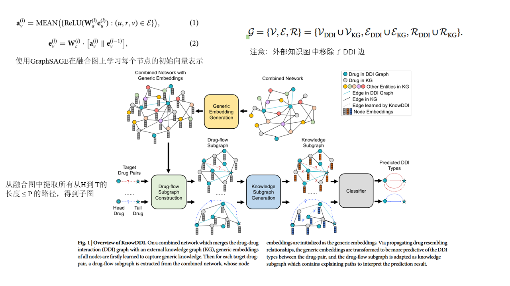
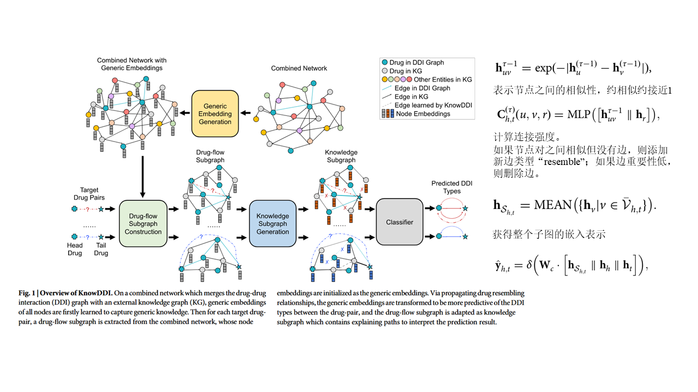
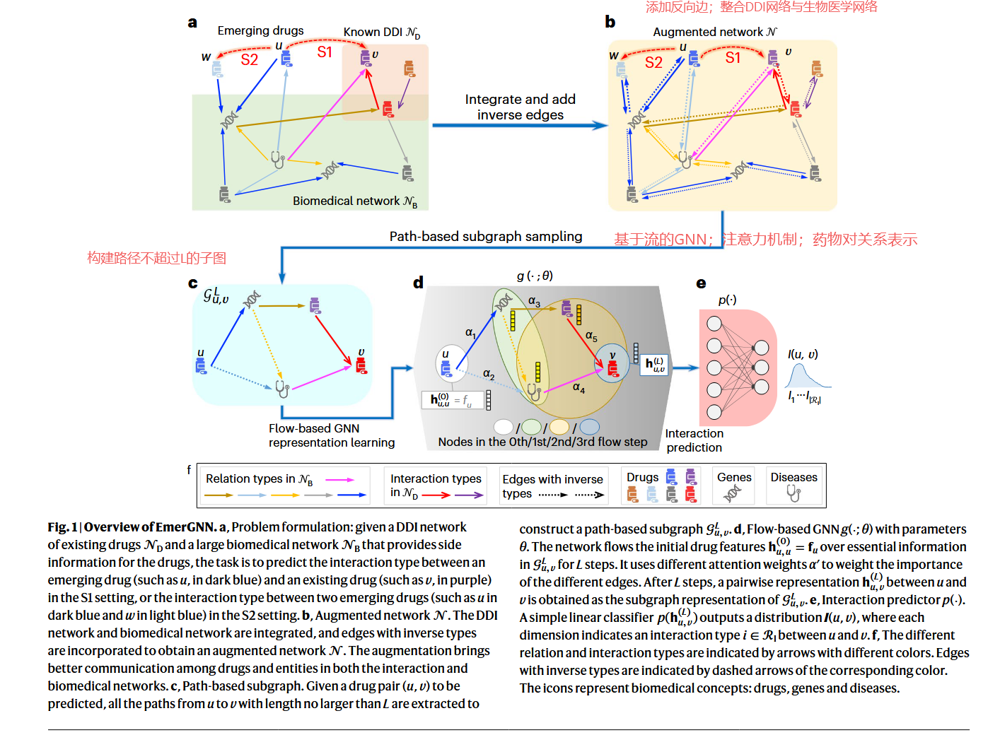

# 1010-周报

## 论文

#### Accurate and interpretable drug-drug interaction prediction enabled by knowledge subgraph learning-KnowDDI方法框架图

#### Emerging drug interaction prediction enabled by a flow-based graph neural network with biomedical network-EmerGNN方法框架图

#### 上面两篇论文的方法较为相似

1. 先将外部网络（包含Gene、Diseases、Pathway等信息，来自Hetionet）与DDI网络结合（来自DrugBank与BioSNAP）
2. KnowDDI在网络中添加**相似边**，EmerDDI在网络中添加**反向边**
3. 提取路径不大于L的子图
4. 将子图用GNN编码，输入到分类器（如MLP）中

#### 实验部分

baseline大致分为以下几类：

- 药物特征：化学结构（分子结构向量）+ 物理性质（分子量+电荷....)
- 图特征：药物特征 + 生物医学网络提取图特征
- 嵌入：事先从药物、基因、疾病等关系图中训练得到静态嵌入向量，然后又这些嵌入向量去训练一个分类器
- 图神经：不断从邻居节点收集信息并更新自己的向量表示
- 是否使用外部图

------

**消融实验**：是否使用相似边/反向边

------

**GNN网络路径选择分析**

- 不同interaction类型之间的相关性的热力图
- 分析模型在做预测时，更侧重哪种边
- t-SNE做聚类可视化

------

**可解释**

给出一个药物对的关系网络，结合已有知识做可解释分析

------

参数、边的数量、interaction的类型数量对模型性能的影响

- 路径长度
- interaction出现的频率：只使用高频的interaction类型、只是用中高频....
- 网络中仅选择模型侧重的边类型

#### 总结

DDI领域可以围绕以下几个问题展开：

- 少样本：元学习、对比学习
- 零样本： 语义嵌入（*Predicting rare drug-drug interaction events with dual-granular structure-adaptive and pair variational representation*）
- 知识迁移：DDI训练的模型，微调后用在药物协同预测中
- 数据稀疏与不平衡：不同interaction类型的数量不平衡
- 可解释性：注意力权重可视化、子图提取
- 可泛化性：已知药+已知药、已知药+新药、新药+新药

## 后续工作

KnowDDI方法中并未使用药物分子结构特征，尝试加入模块添加该特征

