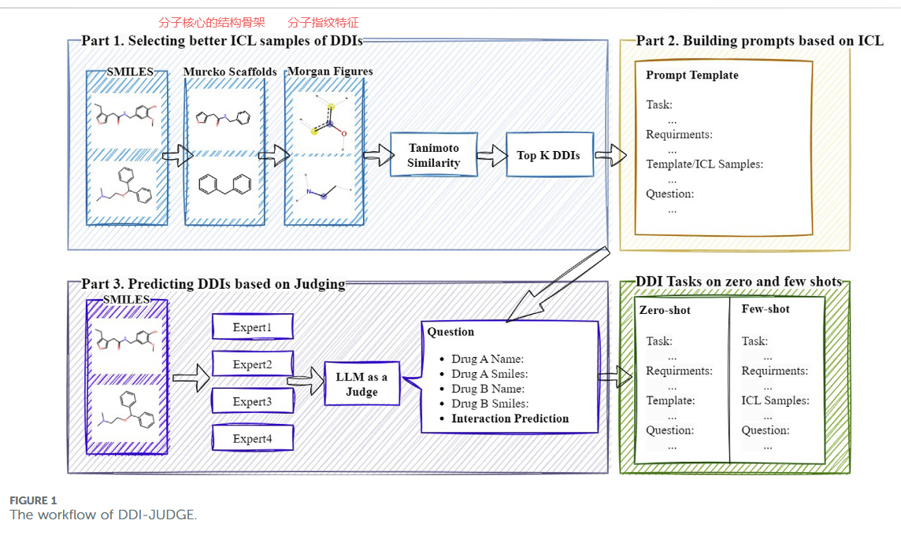

# 1016-周报

## 论文

### Improving drug-drug interaction  prediction via in-context learning  and judging with large language  models

#### 方法步骤

1. 药物分子通过不同的相似性算法，得出相似的top-k药物
2. 根据不同的任务（零样本/少样本）设计提示词
3. 丢给LLM，得出判断（是否会相互作用）

#### 数据来源

[luoyunan/DTINet：一种用于药物-靶标相互作用预测的网络集成方法 --- luoyunan/DTINet: A Network Integration Approach for Drug-Target Interaction Prediction](https://github.com/luoyunan/DTINet)

#### 实验

- 不同LLM的性能
- 不同相似性函数的性能
- 不同示例数的性能

## 上周组会总结

结合联邦学习：数据不涉及隐私，结合联邦学习意义不大

因果推理：可以，增强可解释性
