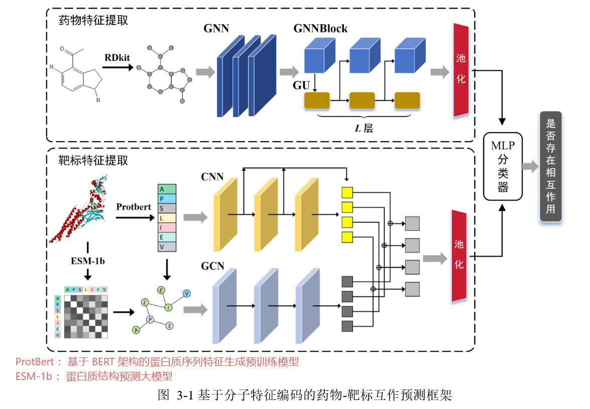
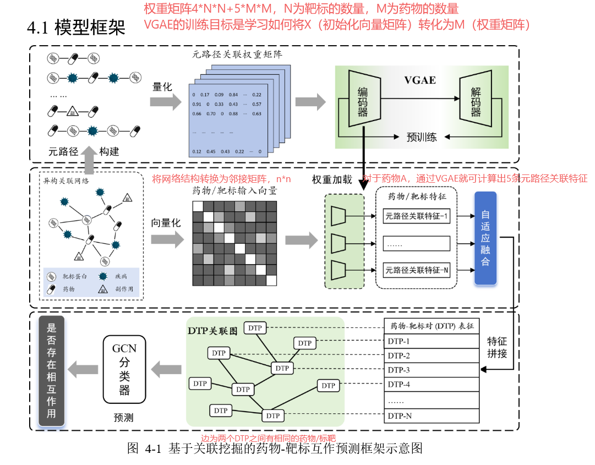

# 1023-周报

## 基于深度学习的药物-靶标相互作用预测-硕士毕业论文

### 问题

现有方法特征提取不充分，可解释性不足

现有方法对生物医药组学大数据中的异质信息挖掘不足，对关联数据的利用不充分

### 解决方法

**基于分子特征编码**：

GNN+GU（门控单元），CNN+GCN

**基于异构图挖掘**：

整合了包括药物、靶标、疾病和副作用在内的四种数据实体，构建了一个异构关联网络。

使用**变分图自编码器（VGAE）**对每种元路径关联矩阵进行预训练和特征学习 ；随后引入自适应权重融合不同元路径的特征 ；最后构建一个“药物-靶标对”（DTP）关联图，并使用GCN分类器进行最终预测 

### 数据来源

**靶标-靶标**的相互作用数据收集自人类蛋白质参考数据库 HPRD和 STRING数据库

**药物-疾病和靶标-疾病**的关联数据收集自毒性与基因比较数据库 CTD

**药物-副作用**的关联数据收集自副作用源数据库 SIDER。

**靶标蛋白质与药物**的相互作用数据收集自 Drugbank 药物记录数据库。

### 实验

- 超参：GNNBlock的GNN层数
- GNNBlock中不同的GNN变体
- 与四个baseline比较
- 可解释性：梯度信息可视化，每层 GNNBlock 单元能够选择性地聚焦于分子图中的关键局部结构模式和一些具有化学意义的子结  构(比如环结构),以整合分子图的整体结构特性。 

### 总结

药物-靶标相互作用预测 (DTI)与药物-药物相互作用预测 (DDI)的异同：

- **药物**通常是小分子化合物； **生物靶标**通常是蛋白质。
- 都广泛采用机器学习和深度学习技术，利用药物的化学结构信息、生物信息等数据进行模型构建 。

论文的两个大章节并不复杂，对应到DDI中感觉可以写：基于分子编码的DDI预测（仅使用DDI信息、药物物理性质等）、基于异构图的DDI预测（使用外部图/信息）。

## DDI-专利

权利要求说明书：基于XX的DDI预测方法，其特征在于....

说明书：技术领域+技术背景+发明内容（现有的不在、问题，本发明的方法创新点、步骤）+具体实施方式（步骤，数据描述，对比/消融实验，可解释性实验）

### 总结

DDI专利内容与之间看的文章基本一致。

## 实验

往RareDDIE模型中加上添加相似边的模块（gsl_model），目前还在理解代码部分，还没完成。

