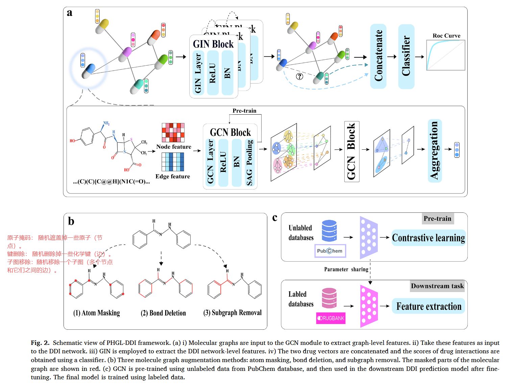
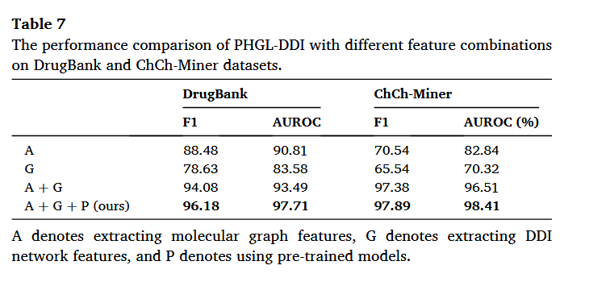

# 1031-周报

## 论文-PHGL-DDI: A pre-training based hierarchical graph learning framework for drug-drug interaction prediction

### 提出问题

**信息不全面：** 现有技术通常只提取药物分子内部的特征，或者只提取DDI网络中的特征，难以全面综合地获取必要信息 。

**复杂结构描述困难：** 对于结构复杂的药物，基于药物子图的预测方法难以充分描述其结构特征和性质 。

**对新数据泛化能力差：** 基于链接预测的方法通常仅依赖网络拓扑，而忽略了药物节点的化学和生物学特性，导致在预测新数据（即未见过的数据）时性能显著下降 。

**数据噪声问题：** 大规模知识图不可避免地会遇到数据噪声问题，这限制了模型的预测精度和泛化能力 。

**标签数据稀缺：** 监督学习模型在泛化到巨大的化学空间时面临挑战，这主要是由于标记数据的稀缺性 。

### 解决方法

- **分层框架 ：**

1. **药物分子图级别 (Graph-level)：** 首先，将药物的SMILES字符串转换为分子图 。使用**GCN** 模块来提取药物分子的图级别特征（如原子的理化特征）。
2. **DDI网络级别 (Network-level)：** 然后，将药物分子视为节点，药物间的相互作用视为边，构建DDI网络 。将上一步获得的药物图级别表征作为DDI网络中节点的输入特征 。使用**GIN** 模块来更新药物表示，学习DDI网络中的拓扑信息 。
3. 最后，将任意查询的药物对的最终向量表示进行**拼接 **，并输入到全连接层（FC）分类器中，以预测DDI的可能性 。

- **预训练:** 

1. 使用来自**PubChem**的大量**未标记**分子数据（1000万条） 。
2. 通过三种分子图增强方法（原子掩码、键删除、子图移除）来创建正样本对 。
3. 使用**NT-Xent**损失函数进行对比学习 。



### 使用的数据集

**GCN预训练数据集：**

- **PubChem：** 收集了1556万个未标记的分子 。经过数据清洗和去重后，随机选择了**1000万**条数据用于GCN模块的自监督预训练 。[PubChem](https://pubchem.ncbi.nlm.nih.gov/)

**DDI预测（下游任务）数据集：**

- **DrugBank：** 一个大规模数据集，包含1706种药物和191,808个DDI元组 。经过预处理（如去除单原子药物、生成负样本等）后，最终得到包含**1606种药物**和**365,927个DDI**的数据集 。
- **ChCh-Miner：** 另一个规模较小的数据集，包含**959种药物**和**33,669个DDI** 。[BioSNAP: Network datasets: Drug-drug interaction network](https://snap.stanford.edu/biodata/datasets/10001/10001-ChCh-Miner.html)

**案例研究（Case Study）数据集：**

- **ZhangDDI：** 用于验证模型在真实世界中的预测能力 。模型在ChCh-Miner上训练，在ZhangDDI数据集（包含544种药物和45,720个DDI）上进行测试 。[ZhangDDI](https://github.com/zw9977129/drug-drug-interaction)

### 实验

### Baselines

DrugBank：DeepDDI，MHCADDI，GAT-DDI，SSI-DDI，DGAT-DDI

ChCh-Miner：EPGCN-DS, MIRACLE, SSI-DDI, DeepDDS, DSN-DDI

### 验证泛化能力

预测**旧药-新药**和**新药-新药**两种药物对

### 各种GNN组合

GCN、GIN、GAT三种GNN的两两组合

### 参数设置

比较了4种不同的分子图增强策略（原子掩码、键删除、子图移除及其组合）

### 消融实验

增加预训练模块至少有2%的性能提升



## 总结

用大量similes数据来预训练一个GCN，以增强对药物分子的表征。这种方法简单、有效，可以借鉴。

```python
#预训练GCN中的对比学习的部分代码
    def _step(self, model, xis, xjs, n_iter):
        # get the representations and the projections
        ris, zis = model(xis)  # [N,C]	model即GCN模型
        # get the representations and the projections
        rjs, zjs = model(xjs)  # [N,C]
        # normalize projection feature vectors
        zis = F.normalize(zis, dim=1)
        zjs = F.normalize(zjs, dim=1)
        loss = self.nt_xent_criterion(zis, zjs)
        return loss
```

## 1031

### 组会总结

看看图神经网络的论文
