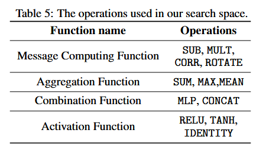
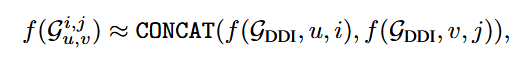
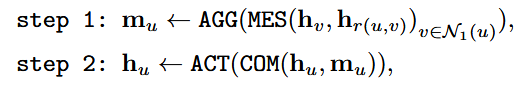
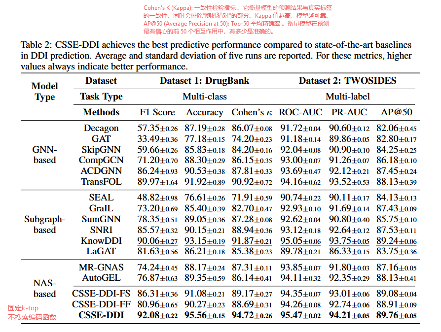
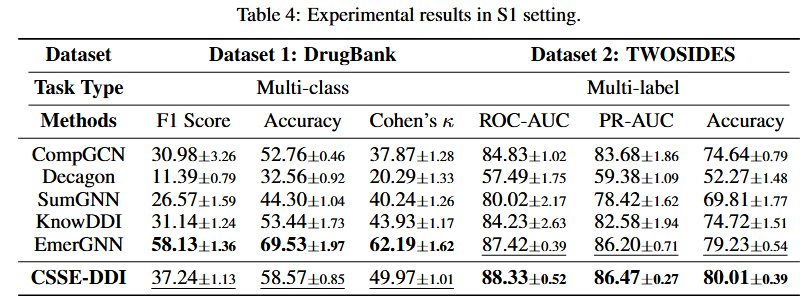
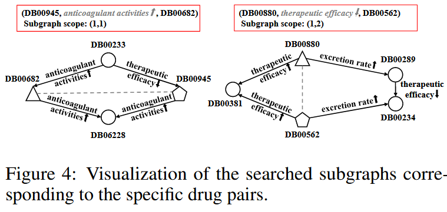
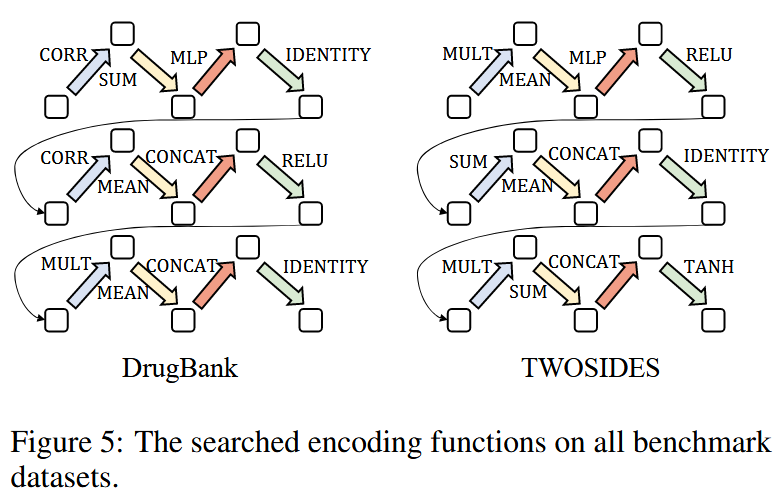

# 1107-周报

## Customized Subgraph Selection and Encoding for Drug-drug Interaction Prediction（NeurIPS 2024）

### 提出问题

- **子图选择：**固定的子图范围（例如，固定提取所有2-hop邻居） 。
- **子图编码：**现有的编码函数（GNN的消息传递函数）是手动设计的，难以同时适应DDI数据中复杂多样的交互模式 。
  - DrugBank 数据集中的相互作用是不对称的，例如，药物A可能降低药物B的排泄率 。
  - TWOSIDES 数据集中的相互作用是对称的，例如，A和B的组合可能导致头痛。

### 解决方法

将**神经架构搜索 (NAS)** 引入基于子图的DDI预测任务，其核心是**自动化地“搜索”出一个定制的DDI预测流水线** 。

------

**1、定义两大搜索空间：**

**子图选择空间：**不使用固定的 k-hop，由药物 u 的 i-top 邻居和药物 v 的 j-hop 邻居的并集组成（例如 (1,1), (1,2), (2,1), (2,2)...(3,3) 等组合）。

**子图编码空间：**基于一个统一的消息传递框架（包含MES, AGG, COM, ACT四个模块），为每个模块提供一组候选操作。

------

**2、设计高效的搜索策略：**

问题：上述搜索空间（尤其是子图选择空间）极其巨大，且显式地采样所有子图在计算上是不可行的 。

1. **使用 Gumbel-Softmax 函数**： 计算出一个**可微分的概率分布**（例如，(1,1) 占 10%，(1,2) 占 80%...）。
2. **子图表示近似**：在整个DDI图上运行一次GNN，用GNN的第 k 层节点表示来近似 u 的 k-hop 的表示
3. **算法**： 采用一种鲁棒的单路径（Single Path One-Shot, SPOS）和分区（Message-Aware Partition, MAP）的搜索算法来稳定地训练。

------

------

### 数据集

DrugBank：1,710 种药物，86 种相互作用类型，134641条边

TWOSIDES：604 种药物，200种相互作用类型，57778条边

### 实验

1、对比实验

已知药+已知药

已知药+未知药

2、搜索算法的选择（MAP/SPOS/MAP+SPOS）

3、参数调优：最大邻居k

4、案例研究

证明 CSSE-DDI 实现了“细粒度”选择，它找到了包含“足够语义信息”的最小子图来支持推理 。

**DrugBank (不对称数据)：** 搜索到的 GNN 包含了更多的 **CORR** 操作。

**TWOSIDES (对称数据)：** 搜索到的 GNN 包含了更多的 **MULT** 操作 。

表明 NAS 不仅是“黑盒调参”，而是真正发现并适应了数据底层的语义模式。

### 总结

可修改的模块

预训练GNN来增强分子结构表征（自监督）（*PHGL-DDI: A pre-training based hierarchical graph learning framework for drug-drug interaction prediction*）

分子结构加边（*ReBind: Enhancing Ground-State Molecular Conformation Prediction via Force-Based  Graph Rewiring*）

分子结构分层（原子、子结构、分子整体）（*UniMatch: Universal matching from atom to task for few-shot drug discovery*）

子图选择

子图编码选择