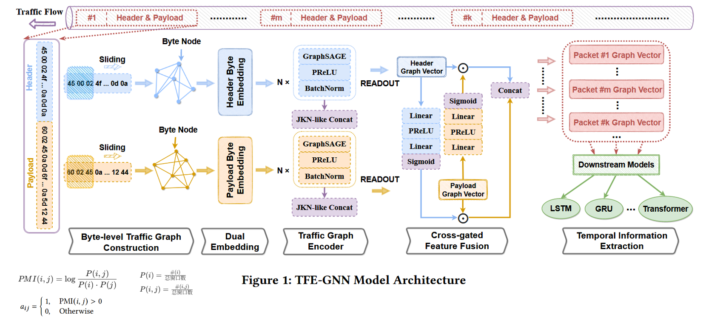
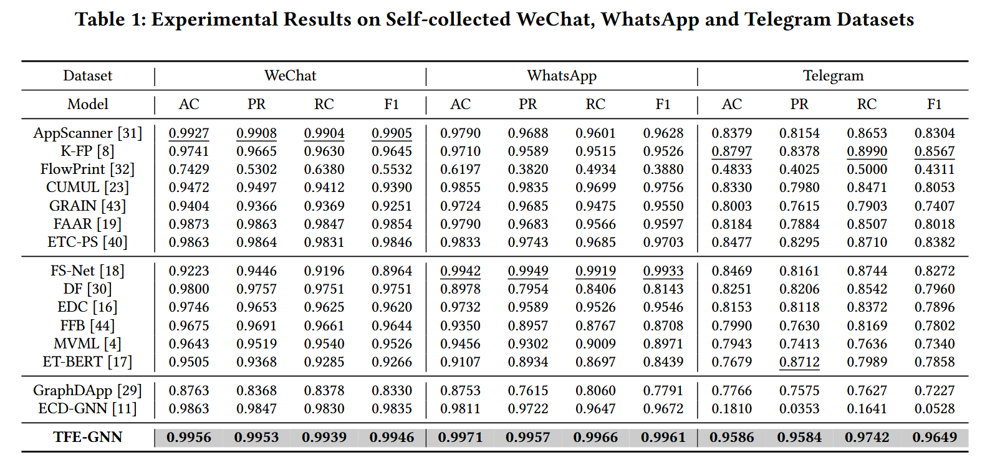
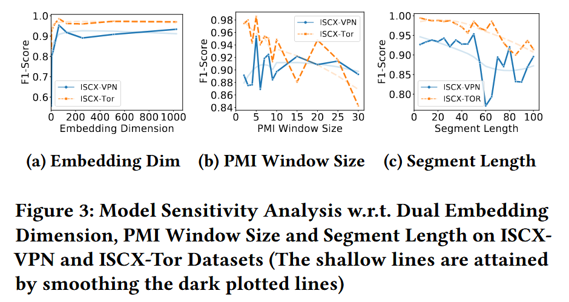
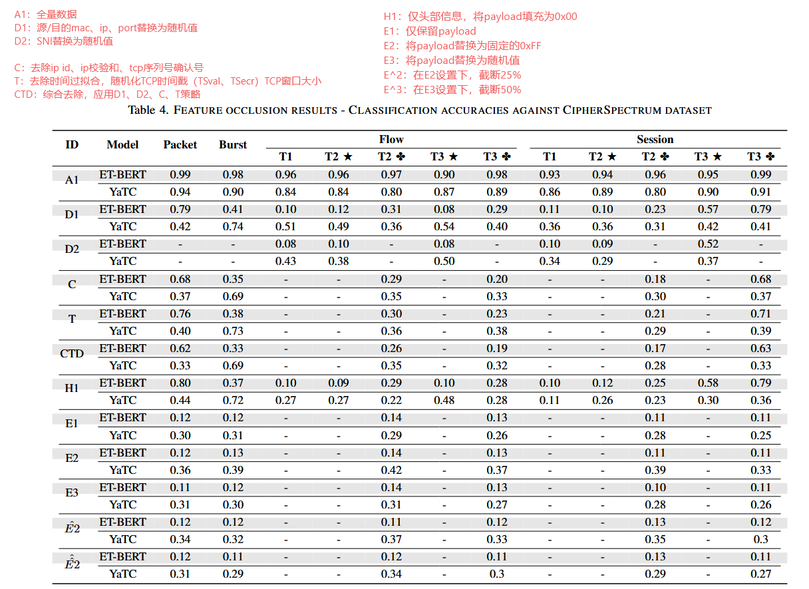
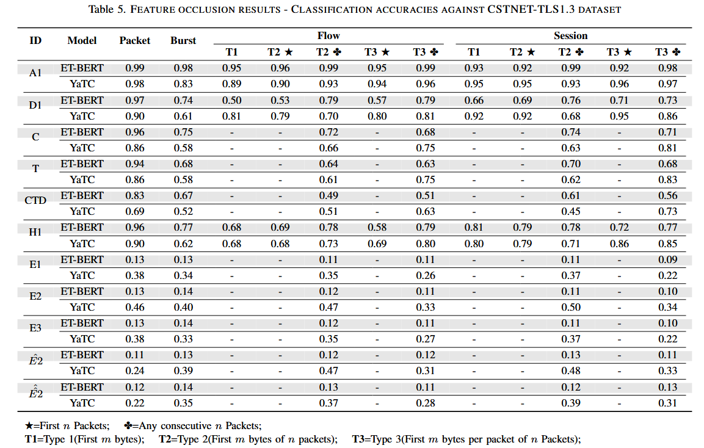

# 1128-周报

## TFE-GNN: A temporal fusion encoder using graph neural networks for fine-grained encrypted traffic classification-加密流量

### 提出问题

流级特征的局限（区别文章中的包级特征）：现有方法大多提取流级别的统计特征

对数据包的header和payload处理不当：混合使用、原始字节利用不足（没有挖掘字节间的潜在关联）

### 解决方法

**基于 PMI 的构图**：利用**点互信息（PMI）**挖掘字节间的语义相关性，构建字节级流量图，而非简单的序列连接 。

**双重处理架构**：将数据包的头部和载荷分开处理，分别进行嵌入、图编码 。

### 方法框架

### 所用数据集

WWT Dataset (自采集，未公开)：包含三个社交媒体应用：WeChat , WhatsApp, Telegram。细粒度用户行为（如发送文字、发送图片等）。WeChat 9 类，WhatsApp 12 类，Telegram 6 类 。

ISCX VPN-nonVPN：选取了 6 类用户行为（如 Email, Chat, Streaming 等）。

ISCX Tor-nonTor：选取了 8 类用户行为 。

### 实验及结果

1、WWT 数据集、ISCX 公共数据集上的性能

消融实验

------

2、模型复杂度

选取了两个指标来衡量模型复杂度 ：

参数选择：FLOPs （浮点运算次数）、Parameters （ 模型参数量）

------

3、双重嵌入的维度、PMI窗口大小、切片长度（即一个样本包含多少个数据包）

### 结论

利用 PMI 构建字节级流量图，从微观语义角度（字节）分析流量，提取高质量的包级特征。

# SoK: Decoding the Enigma of Encrypted Network Traffic Classifiers

## 关键实验

## 结论

1. 绝大多数公开的旧数据集已不再适用于现代加密流量分类研究。
2. 研究者在设计分类器时普遍忽视了由数据泄露、上下文及时间特征导致的过拟合问题。
3. 关于“从密文中学习模式”的普遍假设在 TLS 1.3 环境下是不成立的；**负载长度是唯一可从加密负载中学到的特征**。
4. 仅靠加密负载不足以实现准确分类，网络头部信息仍然是关键。