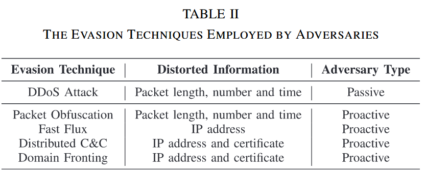
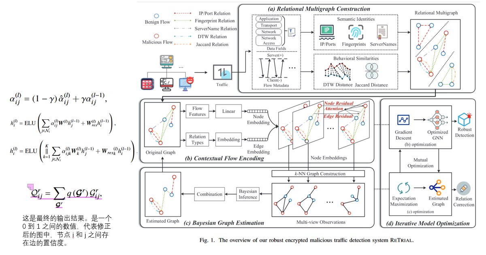
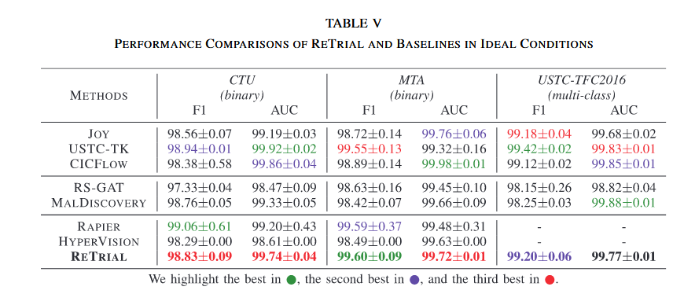
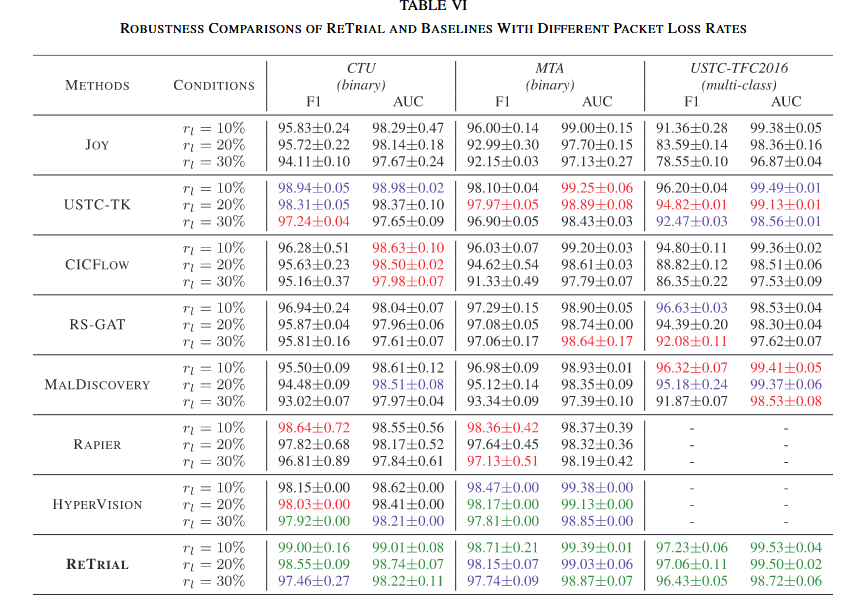
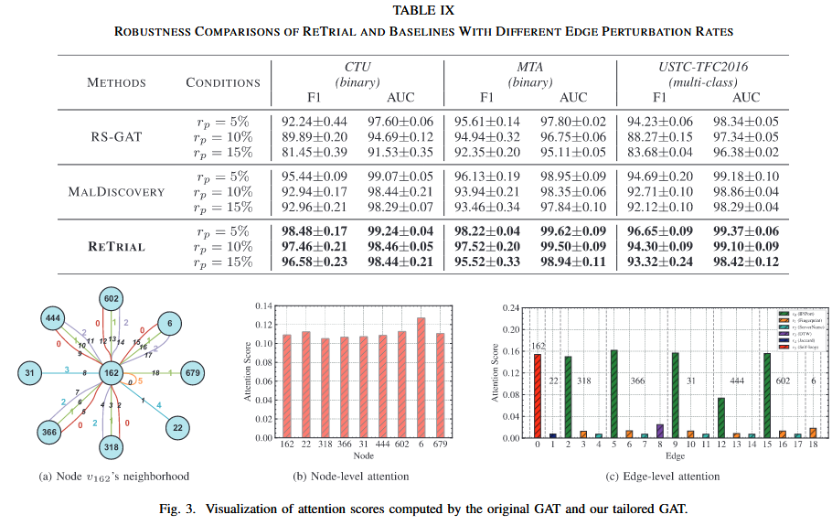
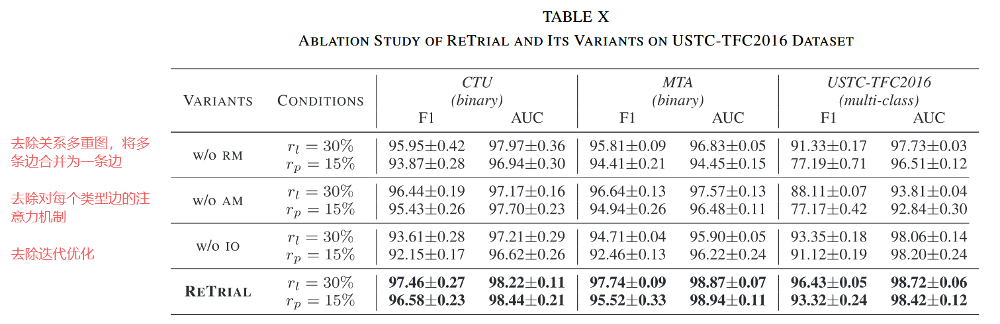

# 1205-周报

## RETRIAL: Robust Encrypted Malicious Traffic Detection via Discriminative Relation Incorporation and Misleading Relation Correction-

### 问题

攻击者使用规避技术，导致分类模型失效

- 分布式拒绝服务攻击 (DDoS Attack)：攻击者协调大量受损主机（僵尸网络），向目标发送海量请求。这种攻击会耗尽目标的 CPU 和内存资源，导致严重的网络拥塞 。
- 数据包混淆 (Packet Obfuscation)：攻击者使用特定的插件或协议（如 Tor 中的 `Obfs4` 网桥中继）来操纵数据包的物理属性（填充、拆分包）。
- 快速通量 (Fast Flux)：一种DNS技术，通过不断更改与单个域名关联的 IP 地址来隐藏恶意服务器。
- 分布式命令与控制 (Distributed C&C)：攻击者不再使用单一的中央服务器来控制僵尸网络，每个受感染的主机都可以充当头目，分发指令。
- 域前置 (Domain Fronting)：攻击者利用内容分发网络 (CDN) 的特性来隐藏真实的通信目标。

### 解决方法

- 节点 = 五元组流 = **{源IP, 目的IP, 源端口, 目的端口, 传输协议}**。
- 边 = **{IP/端口关系，指纹关系（TLS 握手消息，ClientHello、ServerHello），主机名关系（SNI），DTW关系，Jaccard关系}**

### 数据集

- CTU Dataset (CTU-13)

  [CTU-13 数据集。一个包含僵尸网络、正常流量和背景流量的标记数据集。——平流层实验室 --- The CTU-13 Dataset. A Labeled Dataset with Botnet, Normal and Background traffic. — Stratosphere Laboratory](https://www.stratosphereips.org/datasets-ctu13/)

- MTA Dataset

  [IvanLetteri/MTA-KDD-19](https://github.com/IvanLetteri/MTA-KDD-19/tree/master)

- USTC-TFC2016 Dataset

  [davidyslu/USTC-TFC2016: Traffic dataset USTC-TFC2016](https://github.com/davidyslu/USTC-TFC2016)

### 实验

与baseline性能比较

模拟丢包

添加扰动，虚假关系的比例

## 总结

主要针对加密恶意流量检测中面临的规避技术和关系混淆问题，提出：

1. 节点之间不止一条边的多重图
2. 定制 GAT 区分不同关系的重要性
3. （关键）它引入了**贝叶斯图估计**和**迭代优化**机制，能够自动识别并剔除图中的“噪声边”（误导性关系），从而恢复出更清晰的流量交互结构。