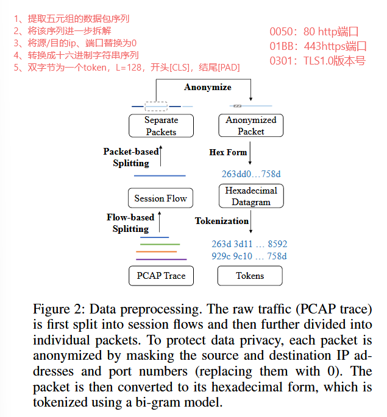
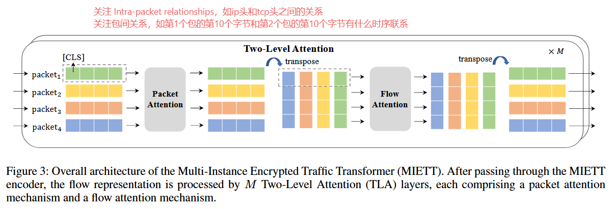
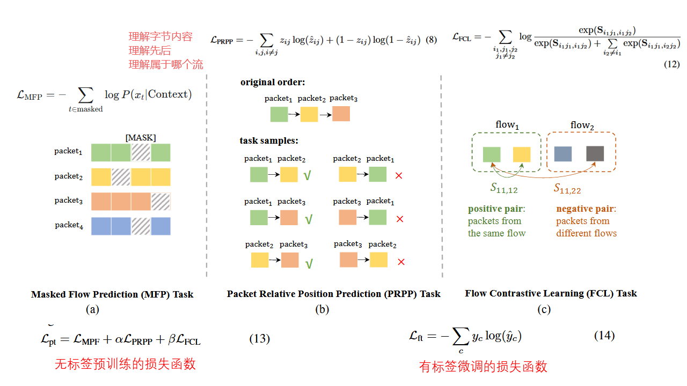
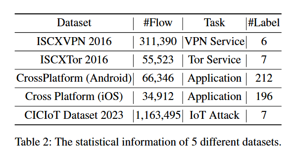
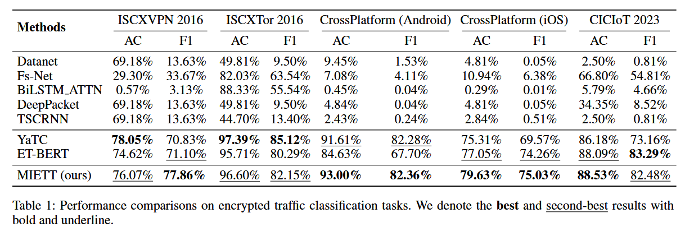
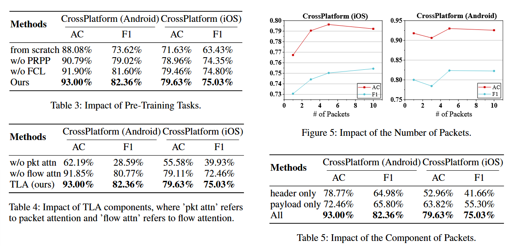
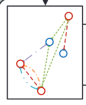

# 1219-周报

## MIETT: Multi-instance encrypted traffic transformer for encrypted traffic classification-AAAI 2025

### 问题

1. 忽略数据包间关系：现有方法往往忽略了同一流（相同五元组）中不同数据包之间的交互关系。
2. 计算复杂度与信息丢失：直接将多个数据包拼接并展平成1D序列会丢失时间信息（如数据包顺序），且随着序列变长，计算复杂度呈平方级增长。

### 解决方法

数据预处理

数据嵌入

预训练与微调

### 所用数据集

### 实验

对比实验

消融实验

### 总结

关注会话流内（相同五元组）内数据包之间的关系，可以作为构建图中的节点嵌入（现有嵌入主要为包长序列）

